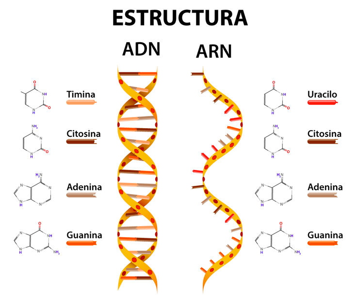
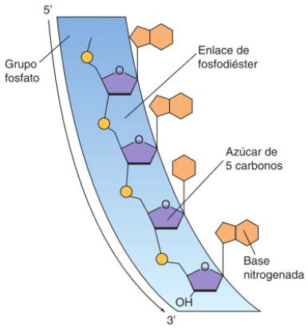
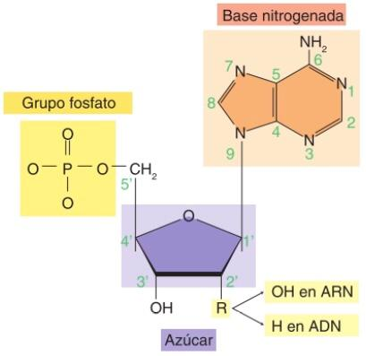

<style>
    p {text-align: justify;}
    h2 {text-align: center;}
    h4 {text-align: right;}
    table {margin: auto;}
    /*  h1 : unit name
        h2 : main topic
        h3 : subtopics
        h4 : date       */
</style>


# Computational Biology
BT1013 Section 829

#### March 23

## Data types and data structures

> Source: [https://swcarpentry.github.io/r-novice-inflammation/13-supp-data-structures/](https://swcarpentry.github.io/r-novice-inflammation/13-supp-data-structures/)

Data types:
- character
- numeric
- integer
- logical
- complex

Data structures:
- vector
    - atomic: single type data
    - list: multiple types
- matrix
- data frame
- factors

Object attributes:
- ```class()``` : kind of object
- ```typeof()``` : object's data type
- ```length()``` : vector/list length
- ```nchar()``` : string size
- ```dim()``` : array dimensions
- ```attributes()``` : metadata
- ```names()``` : list elements names

Missing data: ```NA```
- ```is.na()``` : returns logical vector with ```TRUE``` for each missing value
- ```anyNA()``` : ```TRUE``` if there's any ```NA```

Infinity: ```Inf``` (can be + or -)

Not a Number: ```NaN``` (undefined)

### Vector
- ```vector()``` : empty logical vector
- ```logical(1)```: same as above
- ```vector("character", length=sz)```: mode "character" vector of length ```sz```
- ```character(sz)``` : same as above
- ```numeric(sz)``` : mode "numeric" vector
- ```c()``` : combine function (implicitly coerces to single type)
- ```c(1L, 2L, 3L)``` : mode "integer" vector containing 1, 2, 3 as ```int```
- ```c(TRUE, FALSE)``` : mode "logical" vector
- sequence of numbers:
    - ```1:10``` : vector from 1 to 10 in increments of 1
    - ```seq(10)``` : same as above
    - ```seq(from=1, to=10, by=1)``` : same as above
- ```as.<class_name>()``` : explicitly coerces vectors to class

### Matrix
- filled column-wise
- ```byrow = TRUE``` : forces row-wise fill
- ```matrix(nrow=x, ncol=y)``` : x-by-y matrix
- ```matrix(1:6, nrow=2, ncol=3)``` : 2-by-3 matrix containing ```[1 3 5 ; 2 4 6]```
- alternate method 1:

        m <- 1:6
        dim(m) <- c(2,3)

- alternate method 2 (column bind):

        c1 <- c(1, 2)
        c2 <- c(3, 4)
        c3 <- c(5, 6)
        m <- cbind(c1, c2, c3)

- alternate method 3 (row bind):

        r1 <- c(1, 3, 5)
        r2 <- c(2, 4, 6)
        m <- rbind(r1, r2)

- ```m[x, y]``` : access element in x-th row and y-th column

### List
- ```list(1, "a", TRUE, 3+4i)``` : list containing four elements of different data types
- ```as.list()``` : coerces other objects
- ```vector("list", length=sz)``` : empty list of length ```sz```
- ```list(alpha="Bravo", charlie=1:10)``` : list containing to named elements
- ```li[[x]]``` : access x-th element in list
- ```li$alpha``` : access element named alpha in list

### Data frame
- rectangular list (every element has the same length)
- can be accessed like lists
- attributes:
    - ```rownames()``` : to annotate ```subject_id``` or ```sample_id```
- usually created by ```read.csv()``` and ```read.table()```
- ```data.matrix()``` : converts data frame into table
- ```data.frame()``` : new data frame
- ```data.frame(id=letters[1:5], x=6:10)``` : data frame with letters a-e and numbers 6-10

Data frame functions:
- ```head()``` : shows first 6 rows
- ```tail()``` : shows last 6 rows
- ```str()``` : structure of data frame (name, type, preview of data in each column)
- ```sapply(dataframe, class)``` : shows class of each column

### Summary

| Dimensions    | Homogenous    | Heterogenous  |
| ---           | ---           | ---           |
| 1D            | atomic vector | list          |
| 2D            | matrix        | data frame    |

## Functions

    name <- function(arguments) {operation}
    add <- function(x, y) {x + y}

#### Apr 6

## Bioelementos

### Macromoléculas

- Monómero: unidad básica (e.g. molécula de glucosa)
- Doble enlace facilita reacciones
- Elementos más abundantes: C, H, O, N, P, S
    - C: base, andamiaje (en teoría también puede servir Si)
    - P: parte de fostolípidos en membranas celulares, unión de moléculas
    - S: formacion de aminoácidos (cisteína y metionina)
- Tipos:
    - Carbohidratos
        - Fuente primaria de energía
        - Tienen C, H, O, en proporción 1:2:1
    - Lípidos
        - Insolubles en agua
        - Sólidos a temperatura ambiente (insaturados son líquidos)
        - Delimitar, dar estructura al cuerpo
        - Almacenamiento más rápido para energía
    - Proteínas
        - Polímeros de aminoacidos
        - 50% de peso seco de célula es proteína
        - Estructura:
            1. Primaria: secuencia de cadena de aminoácidos
            2. Secundaria: aminoácidos en secuencia interactúan por enlaces de H
            3. Terciaria: ciertas atracciones entre hélices alfa y hojas plegadas
            4. Cuaternaria: proteína que consiste de más de una cadena
        - Orden de aminoácidos determina estructura tridimensional
        - Estructura tridimensional determina función
        - Tipos:
            - Catalizadores (enzimas)
            - Transporte (hemoglobina)
            - Estructurales (colágeno)
            - Homeostasis (albúmina)
            - Defensa (anticuerpos)
            - Hormonas (insulina, hormona de crecimiento)
            - Locomoción (actina, miosina)
    - Ácidos nucleicos: compuestos de biomoléculas con pero molecular de 25k a 3M, cadenas de nucleótidos
        - Tipos:
            - ADN
            - ARN
        - Nucleótidos (monómeros):
            - Azúcar (pentosa): desoxiribosa (tiene un oxígeno menos, es más estable) o ribosa
            - Unidos por grupo fosfato (-P)
            - Base nitrogenada
                - Púrica (derivada de purina): guanina G, adenina A.
                - Pirimídica (derivada de pirimida): citosina C, timina T, uracilo U.

        

> ADN -> ADN

> ADN -> ARN -> Proteína

### ADN

Polímero de nucleótidos. Puede duplicarse antes de la división celular. Dentro de cromosomas están los genes formados por ADN que contiene info. para hacer proteínas.
- Las cadenas son antiparalelas (una empieza de 5' a 3' y la otra de 3' a 5')
- Interacciones:
    - CG (3 enlaces de H)
    - AT (2 enlaces de H)
- Estructura:
    - Primaria: secuencia de nucleótidos (orden y orientación)
        - Los carbonos se cuentan a partir de la base nitrogenada
        - Cada cadena tiene extremo 5' porque tiene un grupo fosfato libre unido al carbono 5' del nucleótido. Tiene un extremo 3' porque tiene un OH- en la posición 3' del nucleótido
        
        - La otra cadena va de 3' a 5'; 5' representa el extremo terminal del fosfato y 3' el estremo final del átomo de carbono del azúcar (se une a otra molécula).
        
        - Sentido de lectura: 5' a 3'
    - Secundaria: doble hélice antiparalela con bases nitrogenadas unidas por puentes de hidrógeno otorgando estabilidad
    - Terciaria: empaquetamiento del ADN, cromatina (forma compacta)
        - Niveles:
            - Nucleosoma: circulos de proteína
            - Collar de perlas: donde nucleosomas aparecen enrollados
            - Fibras cromatínicas: donde el collar se enrolla en sí formando un solenoide
            - Bucles radiales: durante interfase de ciclo celular, compactación hasta formar cromosomas

### ARN

Cadena que puede enrollarse en sí misma hasta formar hélice de una sola cadena. Copia ADN para producir proteínas, une aminoácidos en orden correcto, forma ribosomas.
- Estructura primaria: igual que ADN pero de menor tamaño
- Tipos:
    - Mensajero (ARNm): copia info. genétida de ADN
    - De transferencia (ARNt): une los 20 aminoácidos en la síntesis de proteínas (los transporta del citoplasma al ribosoma)
    - Ribosomal (ARNr): forma ribosomas con proteínas
- Interacciones:
    - CG (3 enlaces de H)
    - AU